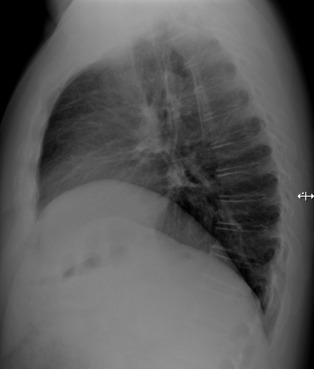

# xray_miclab

**Objetivo;**
O objetivo desse código é de treinar e classificar arquivos dicom e interagir com Orthanc

**Disclaimer**

O repositório está separado em dois códigos diferentes para manter a ordem e a limpeza dos arquivos. O notebook [`definitivo.ipynb`](definitivo.ipynb) foca no meu raciocínio e implementação do código, enquanto o [`main.py`](main.py) é o código utilizado na prática. 

  

### Maiores dificuldades encontradas no desafio
Não estava ambientado na utilização das práticas do docker. Portanto tive que fazer uma pesquisa a parte sobre isso na internet. Pela questão de tempo, foi difícil implementar os arquivos e organizar de maneira ótima para o entendimento de terceiros, mas estou a disposição de tirar qualquer dúvida que seja. Em suma, creio que a parte de implementação do código em si foi bem tranquila, o empecilho foi somente na utilização desses novos meios nos quais não estava ambientado ainda, porém fiz as adaptações que julguei necessárias. 

**Imagens de arquivo dicom:**

### Contribuições
Contribuições são bem-vindas! Por favor, siga estes passos:

- Fork o repositório
- Crie um novo branch (`git checkout -b feature-branch`)
- Faça commit das suas mudanças (`git commit -am 'Adicionar nova feature'`)
- Faça push para o branch (`git push origin feature-branch`)
- Crie um novo `Pull Request`

## Contato
Se você tiver alguma pergunta ou sugestão, contate:
- sergio23040@ilum.cnpem.br

## Referências
- [1] Torchxrayxision. Repositório da biblioteca torchxrayvision. Retirado em 09 de setembro de 2024. Disponível em: https://github.com/mlmed/torchxrayvision
- [2] Orthanc. Documentação do orthanc. Retirado em 09 de setembro de 2024. Disponível em: https://orthanc.uclouvain.be/book/index.html

Obrigado por visitar meu repositório! Happy Coding!

